# Leabhar Maith
<br>
<br>

Click [**here**](https://leabhar-maith.herokuapp.com/) for the deployed website.

<br>
<br> 

## Introduction
  
<br>    


This is a README for an e-commerce website for a hypothetical business called 'Leabhar Maith', meaning 'good book' in Irish. 


Leabhar Maith is a business to customer (B2C) e-commerce site, selling literary products to the user, namely books written in English and Irish by Irish authors. The deliverables will expand in future to include journals, paperweights and stationary with an Irish literary theme. Customers sign up to create an online account and pay via single payments using Stripe. 


Features of this business-focused website include a shopping cart, a catalogue of products that is curated and updated quarterly and is searchable by author or title, an online payment system that can save the customer’s preferred mode of payment, a quarterly email newsletter sign-up, and a featured product every season from a different boutique manufacturer, which comes free with no extra postage fee when the customer spends €70. 


The site was developed using Python in the Django framework and styled using CSS and Bootstrap. ElephantSQL is used for the database and Heroku for deployment. 


<br>

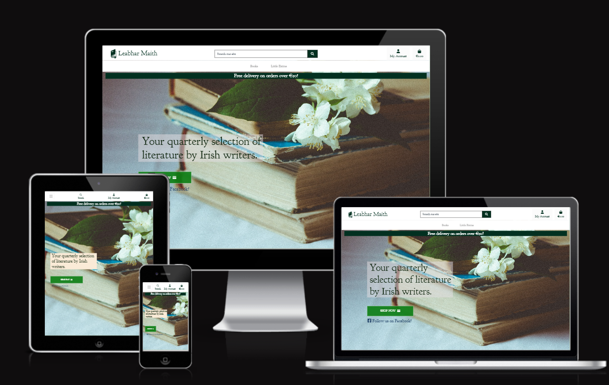

<br>

## Contents


* [User Experience R&D](#User-Experience,-Research-and-Design)
    * [Strategy](#Strategy)
    * [Scope](#Scope)
    * [Structure](#Structure)
    * [Skeleton](#Skeleton)
    * [Surface](#Surface)
* [Web Marketing Strategy](#Web-Marketing-Strategy)
* [Features](#Features)
* [Entity Relationship Diagram](#Entity-Relationship-Diagram)
* [Testing](#Testing)
* [Deployment](#Deployment)
* [Credits, Sources & Acknowledgements](#Credits,-Sources-&-Acknowledgements)


<br>


## User Experience, Research and Design
<br>


I looked at a range of online bookshops, most of which constituted the online presence of a physical shop or chain of shops, such as Waterstones (https://www.waterstones.com/), Easons (https://www.easons.com/) or my local favourite, Vibes and Scribes (https://www.vibesandscribes.ie/). The book industry in Ireland is one where smaller, one-off independent bookshops do not necessarily have a web presence at all, such as my closest bookshop in East Cork, Midleton Books (it does have a Facebook page at: https://www.facebook.com/midletonbooks/). On the other hand, the Book Depository (owned by Amazon) offers free delivery in Ireland, practically every book going, but no physical shop at all (https://www.bookdepository.com/).

<br>

Given the impersonal e-commerce feel of many online bookshops, even those that are linked to a physical shop well grounded in a local area, such as Vibes & Scribes, I wanted to create an alternative that brings a personal feel to online book shopping. Rather like a friendly and knowledgable bookshop owner or assistant, Leabhar Maith offers a curated selection of up to eight books per quarter, recommended by the site owner. The selection changes every four months, with the seasons, so that there is a Spring selection of books, a Summer collection, and so on, bringing a dash of fashion-industry excitement to the concept of new collections being revealed, as well as an ancient feel of Ireland’s connection with the land. Past selections and the books in them can still be accessed and purchased by the site user. There's also the feeling of a book-club to the site, a little like the Guardian bookshop, which is linked to books featured in the Guardian and has a book-club subscription. Subscriptions would be an obvious idea for a future feature of this business. There is a newsletter sign-up that connects the user with new offers and reviews, some of which will eventually be written by selected Leabhar Maith readers. Readers are 'at home' with Leabhar Maith, and can contribute and feel part of it.


Even though Leabhar Maith offers a sense of belonging for the buyer, where there is a feeling of familiarity and friendliness rather than anonymity, users may make purchases in guest-mode. 

<br>

### **Strategy**

<br>

**An Agile Approach**

<br>


Despite being in a team of... one... I used an Agile approach to designing, planning and developing the site. Well, actually, I did get together with another software engineering student from a software testing course, and we pretended we were in a work-place team for the testing of features. We communicated via the ‘issues’ comments on the GitHub project for Leabhar Maith, and this can be seen on the details for each issue/ user-story/ feature-needed-docket. He taught me some of the terminology used for software testing, and we use this in the comments, which was great! 


The first step was to gather the  user stories and record them using  GitHub project tools. An MVP (Minimum Viable Product) was then designed around the requirements that most directly met the needs of each user story. These were then attached to iterations that were time-boxed using the ‘milestones’ feature in GitHub. The list of milestones/ iterations is located at: https://github.com/farah-maria/LeabharMaith/milestones and can be viewed in proper order according by due date here:

https://github.com/farah-maria/LeabharMaith/milestones?direction=asc&sort=due_date&state=open

<br>
<center>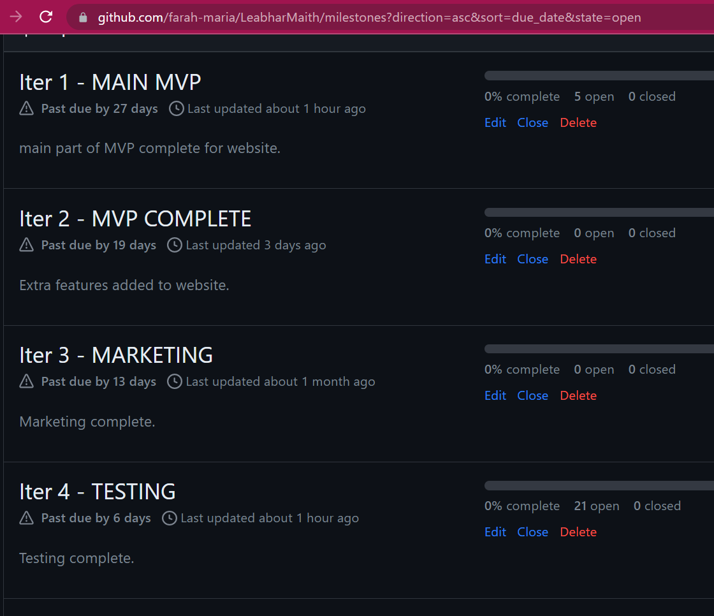</center>
<br>   

Note: issues were not closed using the tick box, but by placing them in the ‘done’ column on the kanban board, so it appears that none of the iterations were completed if judged by the percentage bar. A comment in each states its completion, though.


All of these points, as well as  their testing status, were organised using a kanban board in GitHub. This is called ‘Leabhar Maith Kanban Board’ and it is located at:


https://github.com/users/farah-maria/projects/6/


<br>
<center>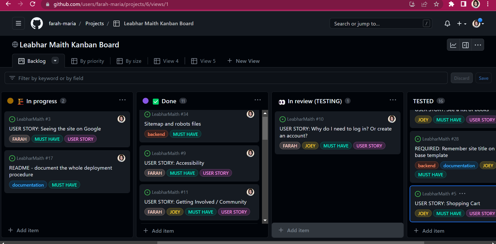</center>
<br>   

The scope of the project can be seen on the board, which I mainly limited to MVP requirements, each of which correlate with the Code Institute pass criteria for the project. 

<br>

### **Scope**

<br>
The project specification outlining the scope of Leabhar Maith is, in this case, necessarily defined by Code Institute marking criteria. It is roughly described as follows:
<br>
<br>

**Project purpose:**

<br>
<em>In this project, you'll build a Full-Stack site based on business logic used to control a centrally-owned dataset. You will set up an authentication mechanism and provide paid access to the site's data and/or other activities based on the dataset, such as the purchase of a product/service.
<br>
<br>
You will also need to create a dummy social media product page as part of your marketing strategy, a newsletter sign-up and SEO.  
<br>
<br>
The site owner, logging in as a particular user, should be able to see a list of all their past orders.
<br>
<br>
Your site should be a Full Stack Web application that incorporates Authentication and role-based Authorisation functionality.</em>
<br>
<br>
<br>
As shown later in this document, there is a Facebook business page for Leabhar Maith, where news and discounts are aimed at growing the pool of potential site users.
<br>

I used the ‘issues’ feature in GitHub to create a list of features necessary to meet the MVP outlined above. GitHub labels were used to order these according to priority, using the MoSCoW method..

<br>

*	Must have
*	Should have
*	Could have (in the future => future features for another iteration)
*	Will not have

<br>

The list of issues used to fill the kanban board can be found at: 


https://github.com/farah-maria/LeabharMaith/issues

<br>

A list of user stories can be found at:


https://github.com/farah-maria/LeabharMaith/issues?q=is%3Aopen+is%3Aissue+label%3A%22USER+STORY%22

<br>
By clicking on a user story heading, the full user story can be accessed with its attached list of functionalities and testing notes.
<br>

Each user story was listed as an ‘issue’, and this was connected via the comments to a list of features needed to fulfil the needs voiced by the story. All aspects of the project associated with the Pass criteria supplied by the Code Institute were labelled ‘Must have’ for the MVP, and these were prioritised by me over all other issues.

<br>

Due to time constraints, certain features were not included in the scope of this project, and none of these are in the ‘Must have’ category. 

<br>

•	I was not able to prioritise descriptive and easy to understand/ short links for the images used on the site, though this doesn’t make any difference on the user experience and user interface side of things, other than the fact that it affects SEO and therefore a potential user is slightly less likely to find the website on Google. (Labelled ‘Will not have’ in Github issues.)

<br>

•	I was not able to prioritise connecting up the email validation for successful transactions on the site, which would have provided the user with a  receipt. They do, however, receive feedback in the form of a pop-up message to say whether or not their payment was successful. 

<br>

Certain features which went above and beyond the MVP list of ‘must-haves’  were included in the scope of this project...

<br>

•	A submittable contact form was included on  a ‘contact us’ page, with a pop-up message that provides validation for the success/ failure of the message being sent. These messages can be accessed via the admin panel when super user credentials are used to log-in. (This was labelled ‘Could have’) 

<br>

•	Three easy to use forms are available for shop staff to enter, delete, read and edit all records relating to stock. These options can be viewed by the ‘my account’ option in the navigation bar when super user credentials are used to log-in. Only one back-end form was required by examiners for this project, but only one form would not have added enough functionality to extend to the featured products sold on the site as well as the books and the authors. 

<br>

All  user stories relating to ‘Must have’ functionalities, which defined the scope of this project, can be found at:

https://github.com/farah-maria/LeabharMaith/issues?q=is%3Aopen+is%3Aissue+label%3A%22MUST+HAVE%22+label%3A%22USER+STORY%22

<br>

####  Summary of Main In-Scope Features:
<br>

* Responsive navigation bar with product search, dropdown menu with book categories, user account access, registration option, and special dropdown list from navbar for shop staff/ superusers who want to edit/ add/ delete stock.
<br>

* A shopping basket to add books to or edit contents/ delete contents.
<br>

* Checkout page that’s easy-to-edit and retains products between visits.
<br>

* Basic information about the business on an ‘about us’ page.
<br>

* Registration option,  with editable data for delivery address and contact details. Profile page on 
‘my account’ shows the customer’s order history and saved of delivery and contact info.

<br>

* Users can receive info on books and upcoming collections through signing up to the newsletter.
<br>

* Free delivery on orders over 50 EUR.
<br>

* Free ‘featured product of the season’ sent out to customers making a purchase of 70 EUR or more. 
<br>

* Page with privacy policy in accordance with GRDP regulations.
<br>

* A ‘contact us’ form with form validation and encouragement to users to send in book recommendations.
<br>

* Link to Facebook business page on the web home page and products page.
<br>

* Newsletter sign-up page with validation.
<br>

* Fully functional Stripe payment checkout in test mode for the purposes of this project.
<br>

* Fully set-up Facebook business page to complement the site.
<br>

* SEO considerations implemented: meta description of content and key search words in head of code. sitemap.xml and robots.txt files are also included in the code. 
<br>

* Advertising campaign for 'badly made books' notebook company to mutually increase brand reach. Their A6 notebook is the first season's 'featured product' - a concept to allow for ongoing advertising slots for different Irish stationary companies, to increase revenue for Leabhar Maith. 
<br>
### Future Features

<br>

While a subscription service option would certainly suit Leabhar Maith, for this initial version of the project it only offers one-off purchases, as I was learning to set up Stripe payment integration for the first time.  A subscription service would be a great future feature. 
Meanwhile, the curation of groups of books encourages buying multiple books, plus there is a cost benefit to larger purchases in terms of free delivery and the featured product of the season free of charge.
<br>.
As mentioned above in the 'Scope' section, email validation also has yet to be implemented.
<br>

* To implement: a subscription service for all 6-8 books per quarter at 10% off the full cost.
<br>

* To implement: email validation messages for successful purchases sent to the customer.
<br>

* To implement: delivery cost realistic to areas being delivered to rather than a flat 10%
<br>

* To implement: a book blog to extend branch reach and customer involvement.
<br>

* To implement: creation of the newsletter content, which could involve reaching out to existing subscribers to submit book reviews and musings, as well as features about Irish authors and the Irish language.
<br>

* To implement: literary and Irish language events run by Leabhar Maith to grow the reach of the brand and increase subscriber base.
<br>

* To implement: extend advertising for Irish crafts and stationary companies.
<br>

* To implement: functionality for users to leave reviews. 
<br>
<br>

### **Structure**
<br>

* Homepage will be the landing pad with key links attached to the navbar .
<br>

* The navbar will provide the menu of options for all available pages. All pages are reachable from every other page via the navbar. 
<br>

* Book category page filterable by genre/ category of book .
<br>

* Clicking on a book or the ‘further info’ button underneath will take user to the book detail page. It can be added to the shopping basket here, where the user can either continue shopping or checkout and pay.
<br>

* The Navbar menu will collapse and be responsive for mobile and tablet devices.
<br>

* Title of the site is a clickable link back to the home page.
<br>
<br>

### **Skeleton** / **Wireframes**
<br>
I used Balsamiq to create a skeleton of what the main two landing pages of the site would look like, combined with mock-ups from a very similar e-commerce practice-project I completed with the Code Institute called 'Boutique Ado'. The Boutique Ado page mock-ups will form the template for my own equivalent pages on the Leabhar Maith site, e.g. the shopping basket icon on the navbar will turn blue and start showing the basket total when the user starts adding books to it in a similar way, and the icon for the shopping cart will be the same. I won't be reinventing the wheel in terms of the appearance and structure of my e-commerce site, but I will be adapting the code and creating new features where this suits the specific needs of an online bookshop. 
<br>
<br>
<center>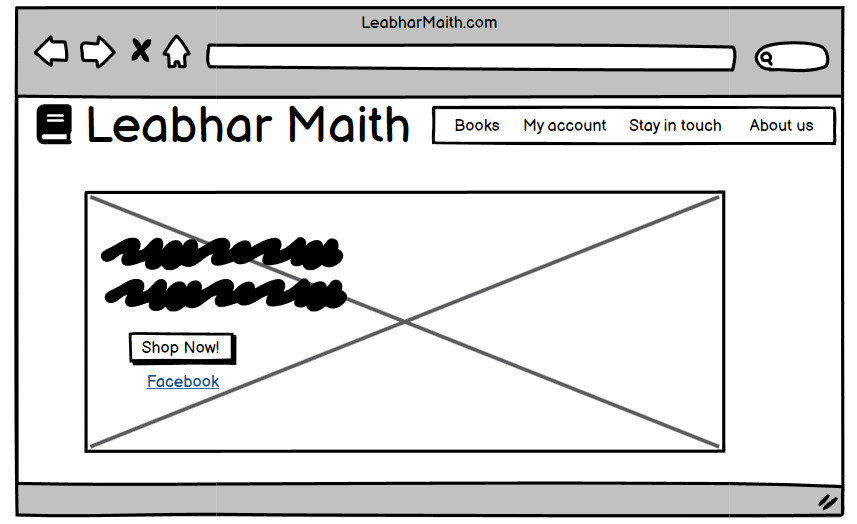</center>
<br>   
<br>
<center>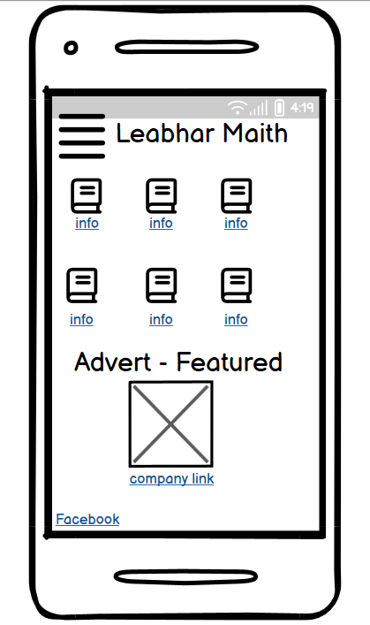</center>
<br>   
<br>
<center>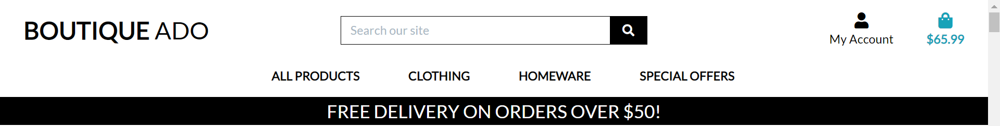</center>
<br>   
<br>
The product detail page shown below will show the information required for a book rather than an item of clothing (ISBN, author, title, publisher etc) and there will be an image of the book cover to the left of the information. But the rough style and positioning of the buttons will remain the same.
<br>
<br>
<center>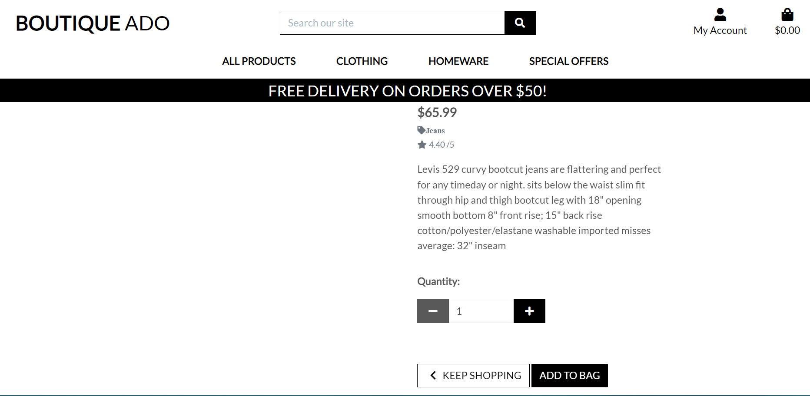</center>
<br>
<br>
<center>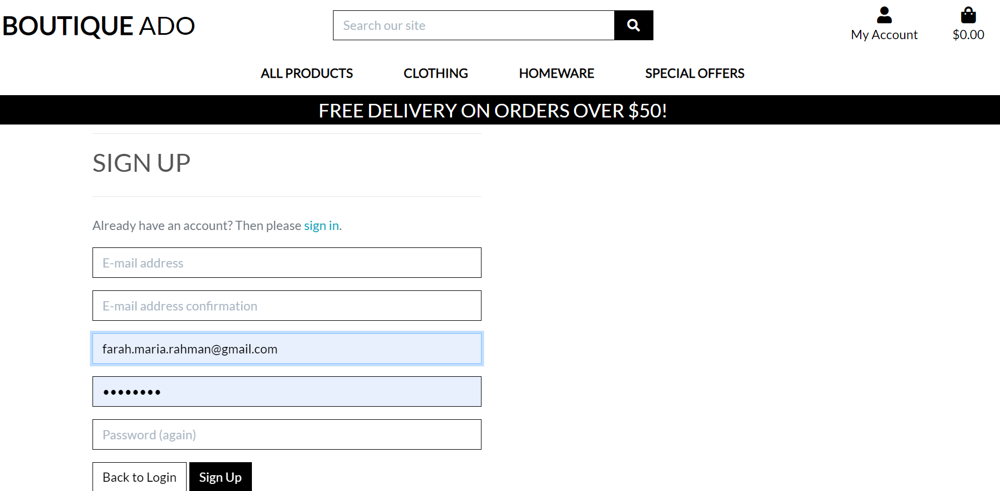</center>
<br>   
<br>
<center></center>
<br>   
<br>
<center>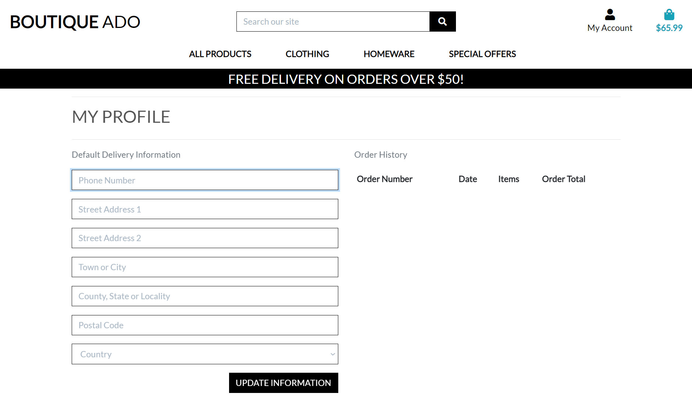</center>
<br>   
<br>
<center>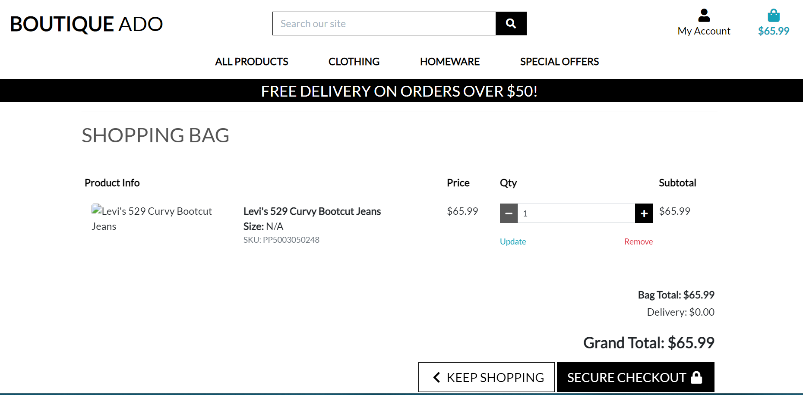</center>
<br>   
<br>
<center>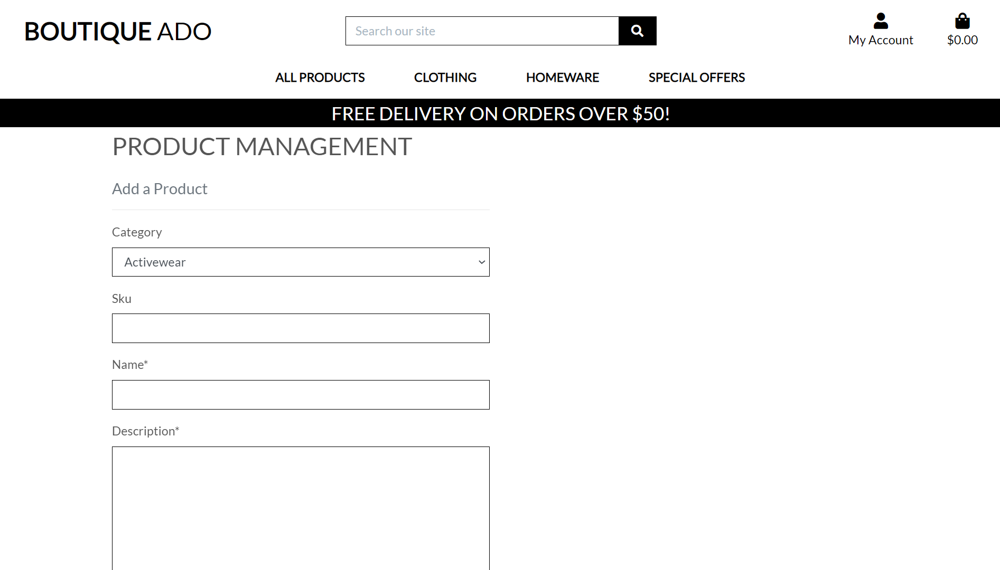</center>
<br>   
<br>
Bottom of add product page for staff below (need to scroll down):
<br>
<br>
<center>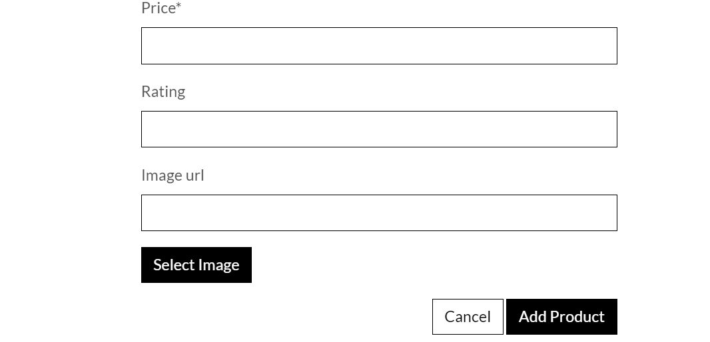</center>
<br>   
<br>

### **Surface**

<br>
<br>

* Colour palette: the colours are based around shades of green, as the colour green is associated with the 'Emerald Isle' of Ireland.
<br>
<br>

* Fonts: the fonts have a literary theme, with handwritten-style headings and old fashioned book-type font for the main text and title of the website. 
<br>
<br>

* Logo: the logo shows an image of a green coloured book.
<br>
<br> 

* Favicon: the favicon shows a little pile of green coloured books.
<br>
<br>

* Forms: forms are styled using crispy forms templates to improve their appearance.
<br>
<br>

### **Entity Relationship Diagram**

<br>
<center>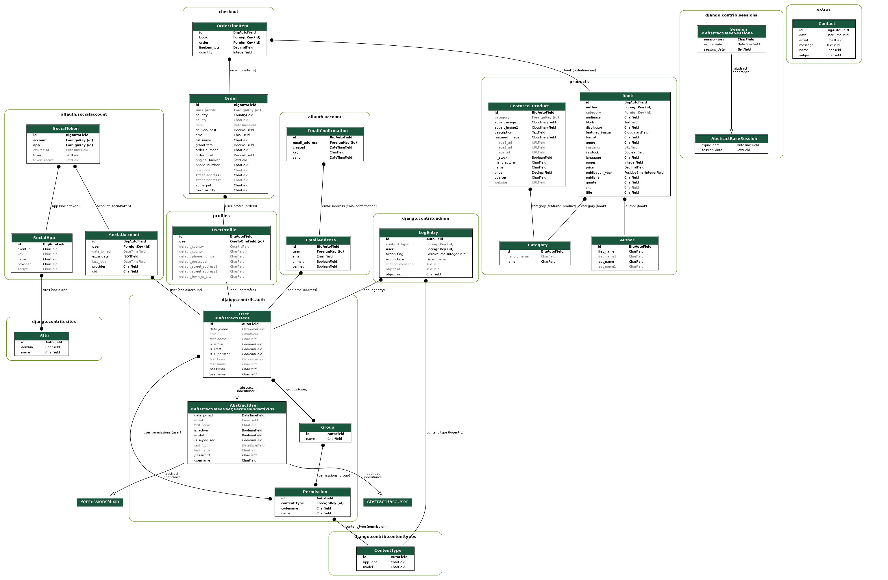</center>
<br>   
<br>

### **Testing** & BUGS!!!
<br>
<br>

#### **Manual Testing of Features**
<br>
<br>
Comments from my agile 'team' relating to testing can be found attached to each testable GitHub issue. My friend Joey taught me some software testing protocol in report writing... 
<br>
<br>
<center>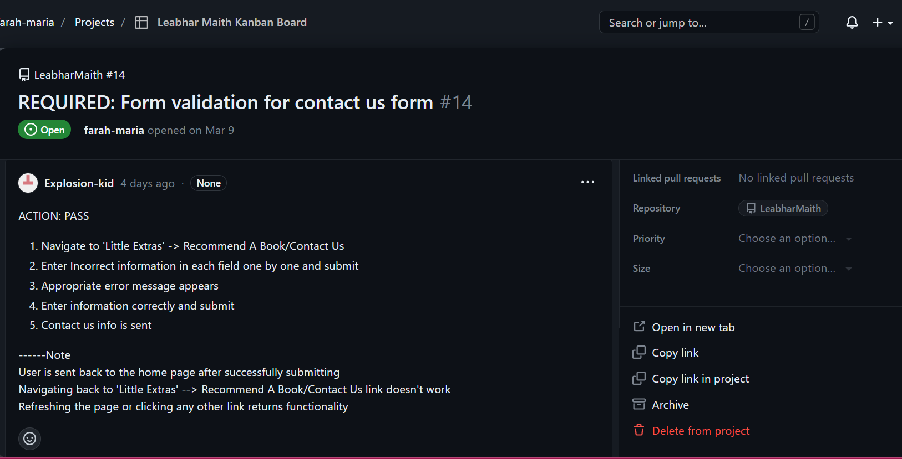</center>
<br>
<br>
The following bugs were found during manual testing:
<br>
<br>
<center>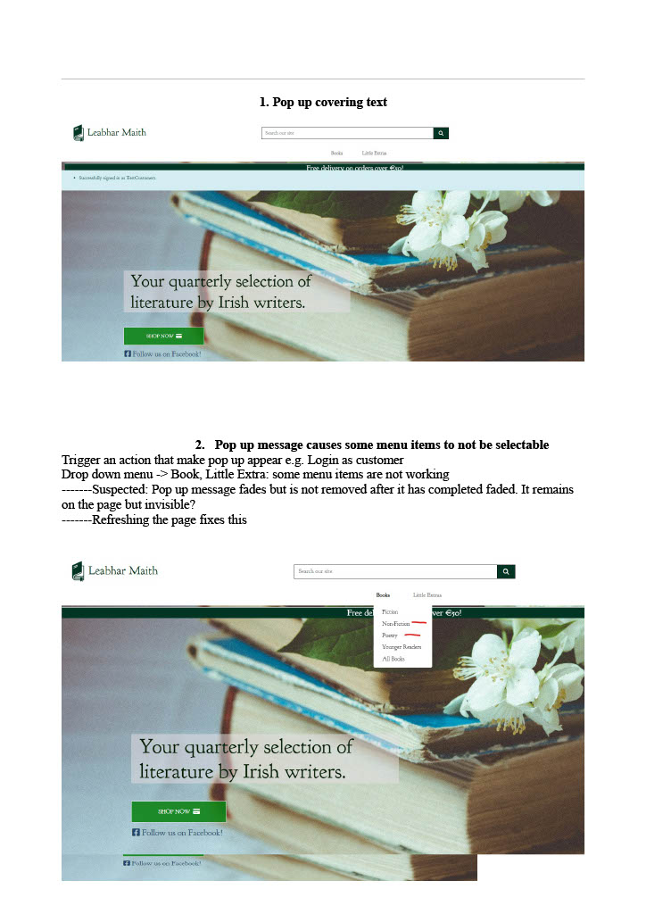</center>
<br>
<center>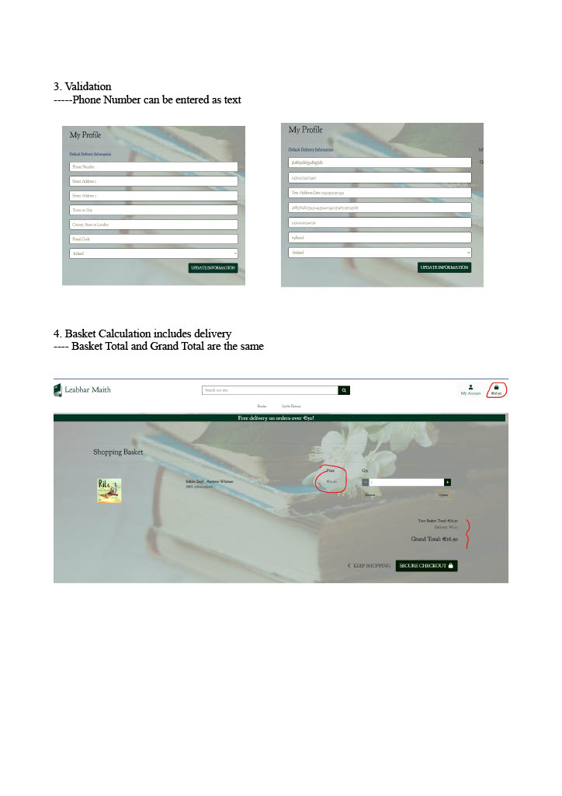</center>
<br>
<center>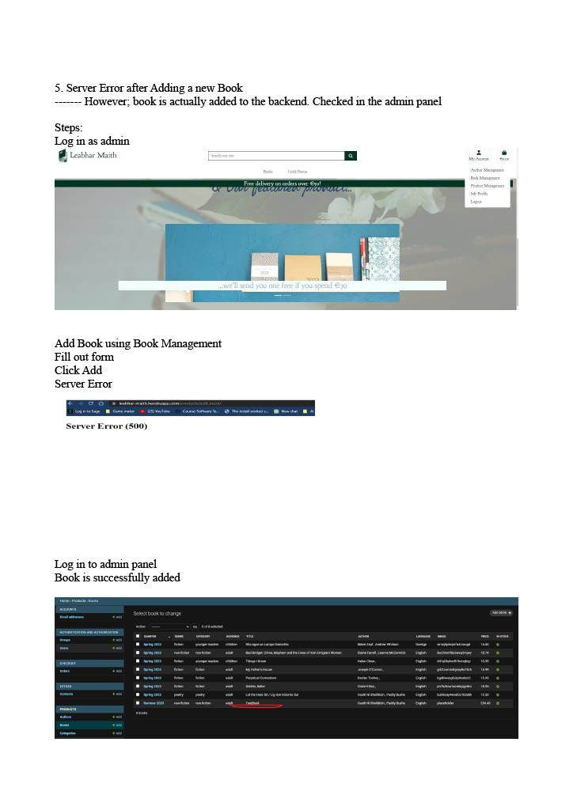</center>
<br>
<br>
Most of these were resolved, and this is the final checklist of features manually tested and the pass/ fail result of each test.
<br>
<br>
<center>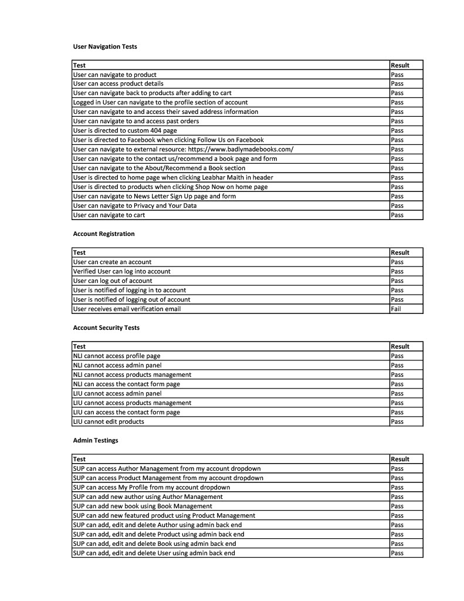</center>
<br>
<center>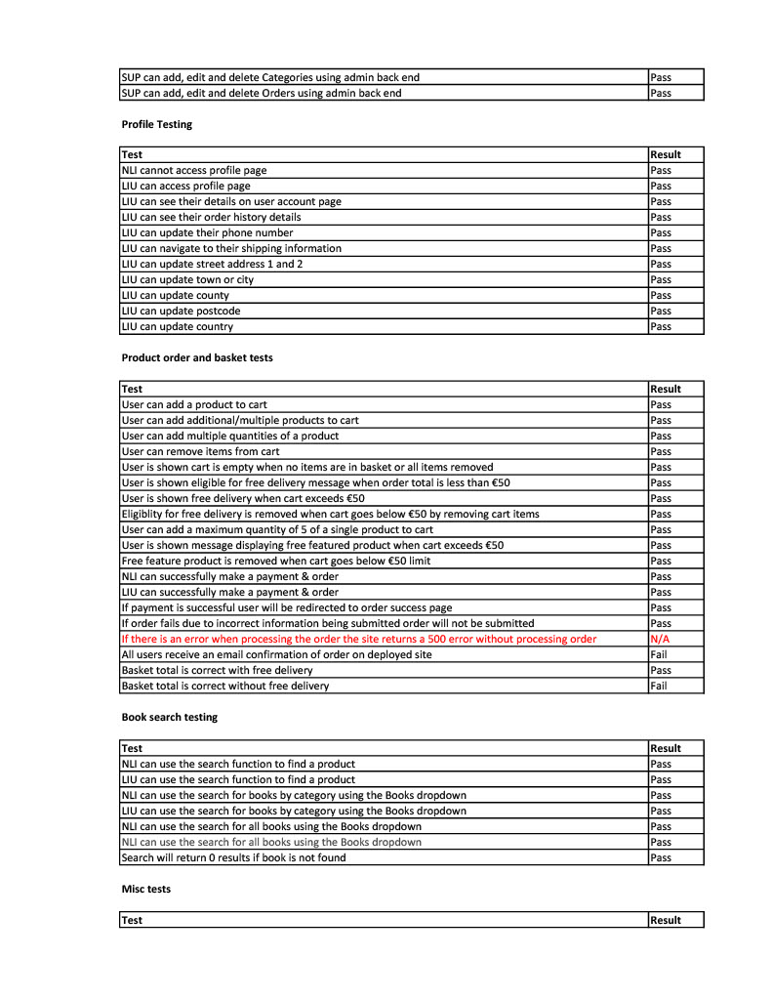</center>
<br>
<center></center>
<br>
<br>
In future, it would great to do some automated testing. In this case, time limitations meant that wasn't possible.
<br>
<br>

#### **CODE VALIDATION**

<br>
<br>

**W3C Reports for HTML:**
<br>
HOME PAGE:

https://validator.w3.org/nu/?showsource=yes&doc=https%3A%2F%2Fleabhar-maith.herokuapp.com%2F#l211c7

All errors but one are in the source code for the Boutique Ado walkthrough project, which formed the basis for this repo, so I didn’t want to change it in case it broke the functionality in some way. An example of such an error is that the <title> is considered to come after too much content. But this content is in fact the background info for the navigation bar rather than the main content, so in fact the title is on the page in the correct place.
The category ‘younger readers’ was raising an error due to the space, so I changed the category name to ‘childrens’ without the apostrophe and created a new fixtures file straight afterwards.
<br>
<br>
ALL PRODUCTS PAGE:
<br>
https://validator.w3.org/nu/?showsource=yes&doc=https%3A%2F%2Fleabhar-maith.herokuapp.com%2Fproducts%2F#l211c7
<br>
As with the homepage, most errors from Boutique Ado walkthrough project, which seem to have a sensible justification. My error was to enter “class=……” twice for two class names relating to the same <a> element. I corrected this to using “class” just once, and adding both class names to it separated by a space.
<br>
Error: "Attribute target not allowed on element img at this point."
<br> 
This was confusing. I’d added target=_blank to ensure the images opened in a new tab and had done so in the same way as in the Boutique Ado walkthrough lessons.
<br>  
<br>
I left this alone, again as it was based on the Code Institute's own recommended code.
<br>
<br> 
The html for the featured product contained a paragraph as a child of an anchor tag. This was an error of mine, and I removed it (it was unnecessary anyway).
<br>
There was a typo at the end of a tag, <s/a> instead of </s>. I corrected that. And an unclosed <div> for the advert-carousel, which I closed.
<br>
All other “errors” from Code Institute recommended code.
<br> 
<br>
PRODUCT CATEGORY PAGE:
<br>
https://validator.w3.org/nu/?doc=https%3A%2F%2Fleabhar-maith.herokuapp.com%2Fproducts%2F%3Fcategory%3Dnon-fiction&showsource=yes
<br>
Only errors were ones mentioned above already, repeated on other pages.
<br>
<br>
PRODUCT DETAIL PAGE:
1.	Warning: The type attribute is unnecessary for JavaScript resources.
From line 326, column 1; to line 326, column 31
TUTE --> ↩<script type="text/javascript">↩↩ 
<br>
<br>
This is from quantityjs.html, but is in the Boutique Ado code. I removed it anyway, as it seemed incorrect to me.
<br>
<br>
ROCKET VALIDATOR FREE TRIAL supplied an all-pages report for the HTML of the site:
<br>
https://rocketvalidator.com/s/2478de46-af56-4f88-a3f3-42bdaaeefba0
<br>
The report shows that all other errors were the same errors from the source code mentioned above.
I left them alone for the same reason, and was hugely appreciative of the time that Rocket Validator saved me!
<br>
<br>
<br>
<center>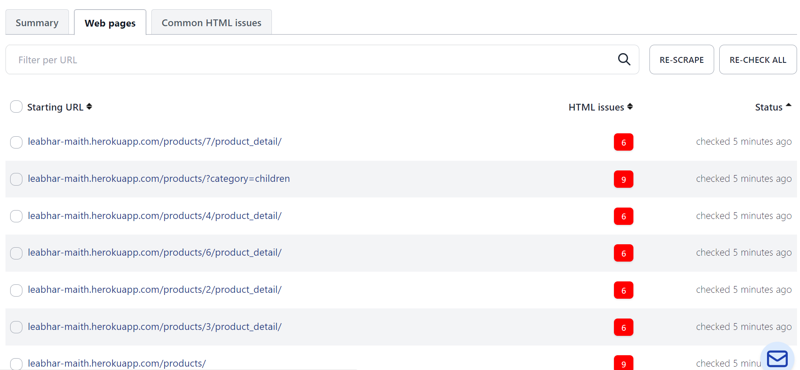</center>
<br>
<br>
<center>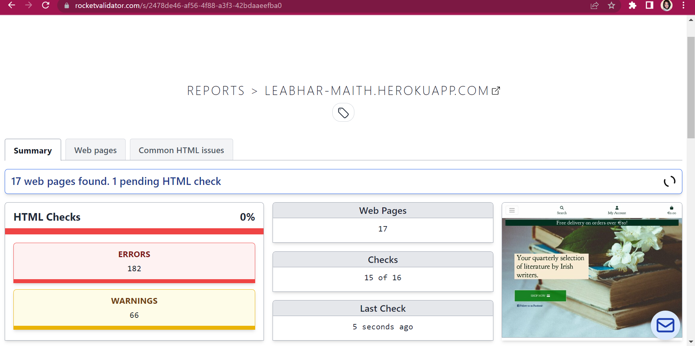</center>
<br>
<br>

**W3C Jigsaw Reports for CSS:**
<br>
<br>
All code passed, for base.html and separate css file for user profiles (profiles.css).
<br>
<br>
<br>
<center>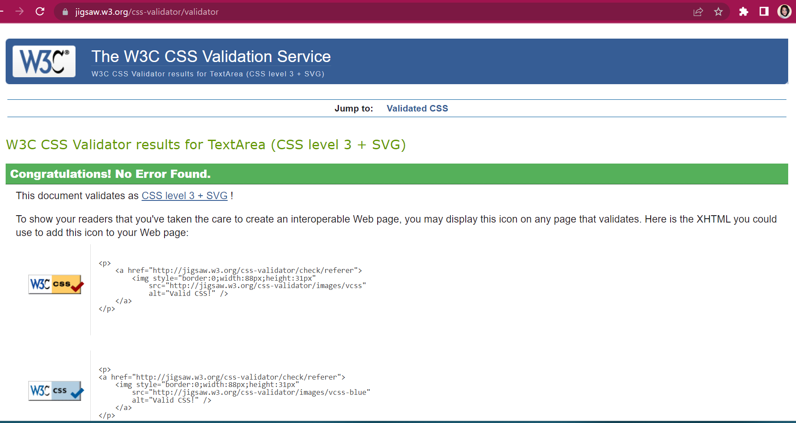</center>
<br>
<br>
<center>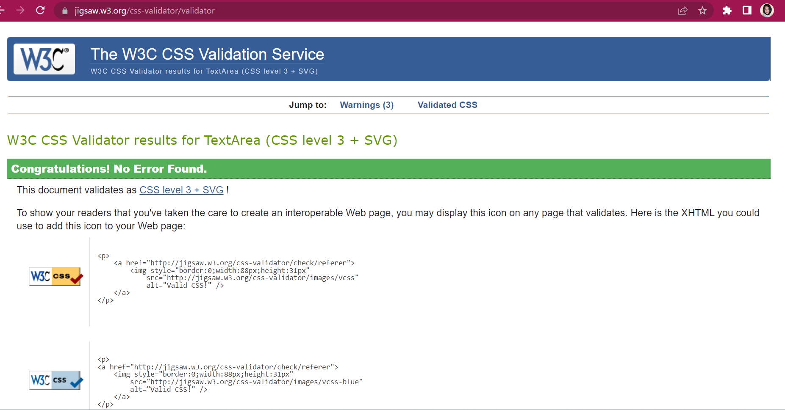</center>
<br>
<br>

**PEP8 CodeInstitute Validation for all Python Code**
<br>
This tool can be found at:
<br>
https://pep8ci.herokuapp.com/
<br>
<br>
All passed apart from a few lines that were too long, but these had to be left either because they were from source code or because my IDE linter (in GitPod) was raising an issue when I 'corrected' my line breaks according to the recommendations of the PEP8 tool. Rather than do the incorrect thing with my code due to conflict between the recommendations of two apps, I left the lines the same as I knew the code was still actually functioning from the results of manual testing.
<br>
<br>

**JShint Testing of Javascript and JQuery**
<br>
<br>
All passed apart from an issue with ES6 use of lamba =>, which wasn't yet recognised by JShint. 
<br>
<br>
<center>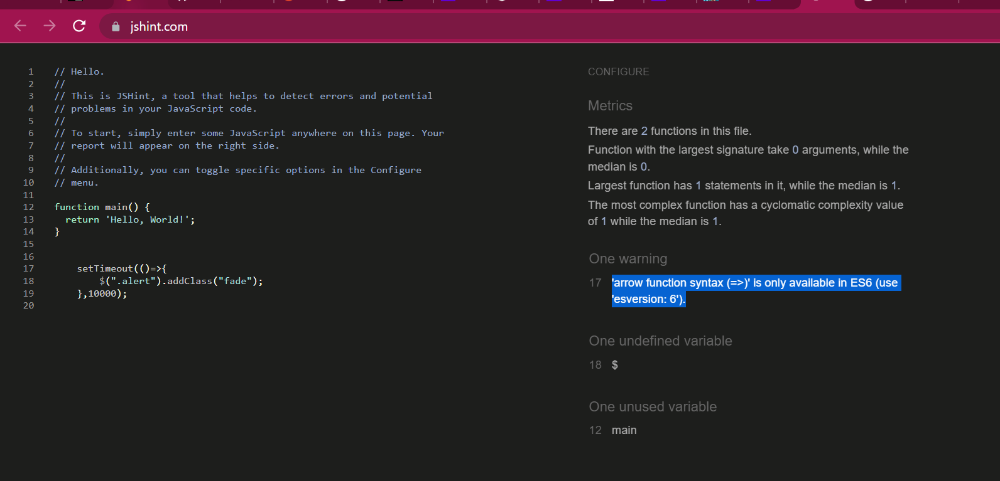</center>
A fix for this
was found om StackOverflow, which was to add the following:
<br>
<br>
<center>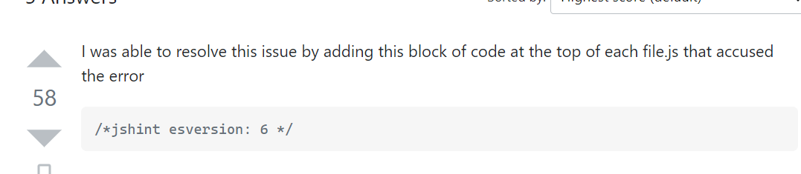</center>
<br>
<br>

#### **LIGHTHOUSE REPORT RESULTS FOR ACCESSABILITY AND SEO**
<br>
<br>
Results varied according to internet connection, but the SEO and Accessability scores were high for both desktop and mobile versions of the site. The first image below is for the desktop version and the second is for the mobile version.
<br>
<br>
<center>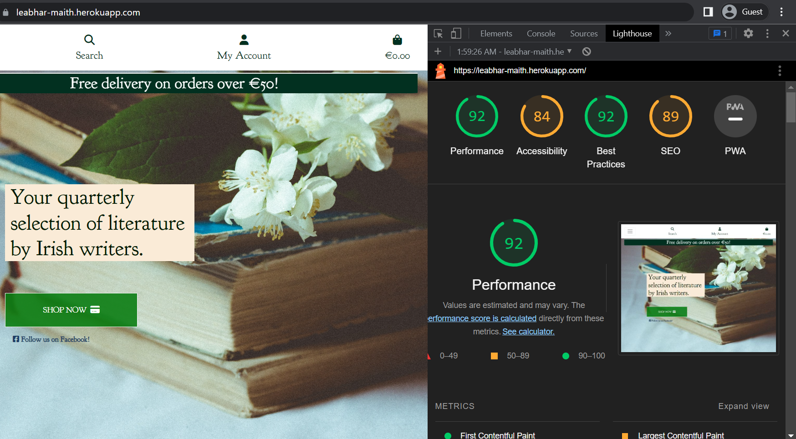</center>
<br>
<center>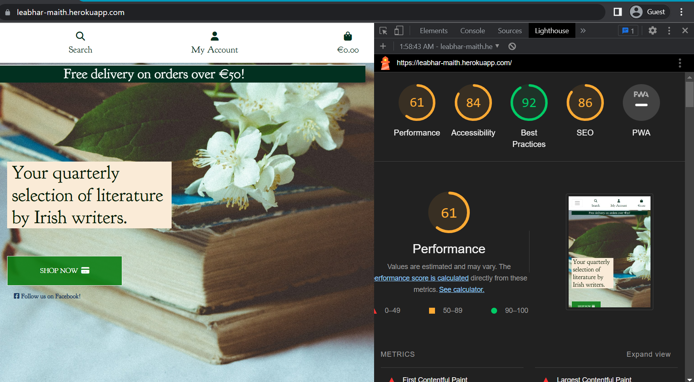</center>
<br>
<br>

## **Web Marketing Strategy**
<br>
<br>
Search Engine Optimisation is an important part of any marketing strategy in an age were Google and Googling have become verbs. Whether a website comes up on the first page of a search via relevant keywords is a huge part of a brand being 'seen'. A website’s search engine ranking involves allowing its pages to be crawled and indexed by a robot/ bot. To make sure that Leabhar Maith gives the bots the information they need to read the site quickly, a robots.txt file and a sitemap.xml have been generated and are included in the code repository. I have blocked off accounts information from this, as there is no benefit for google to crawl such pages, and the files may well contain private information relating to a user's bank account, transactions and private contact details. 

<br>
<br>
The keywords added to the meta description section at the head of the base.html file is important, and it's important to use these throughout the site as well. I chose the following a list of short tail keywords for this purpose:
<br>
<br>
irish literature, books, irish language, as gaelege, irish fiction, irish poetry, irish interest, cork, badly, online bookclub, younger readers,
<br>
<br>
<br>
and the following long tail phrases:
<br>
<br>
irish non-fiction,
irish young adult fiction,
badly made books,[advertiser on the site]
irish children's books,
<br>
<br>
The logo is also an important part of the Leabhar Maith brand, which I customised to match the dark green colour of the text used on the site. 
<br>
<br>
<center></center>
<br>
<br>
The logo is free for non-commercial use and is by ICONS DB. It can be found at:  https://www.iconsdb.com/custom-color/book-16-icon.html and can be changed to any colour by hex code.
<br>
<br>
Another part of the Leabhar Maith marketing strategy is its Facebook Business Page

To view the facebook business page you can click on the link below:


[Facebook Business Page](https://www.facebook.com/profile.php?id=100091762610528)


In case the page becomes deactivated by Facebook, here are some screenshots:

<br>
<br>

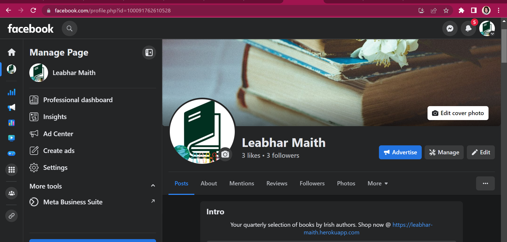

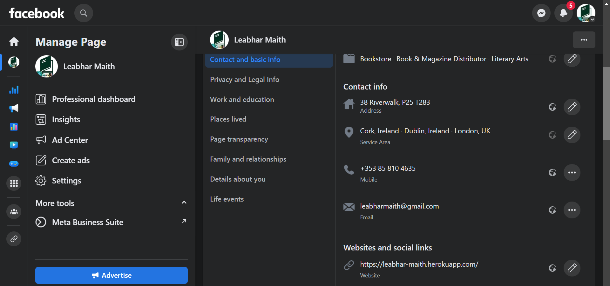
<br>
<br>
The same cover image is used as in the homepage for the company website, and the business logo is also used
for consistency of brand image. Consistency in the company colours and images makes the brand easier to recognise and remember.
<br>
<br>
For new users who land on the Facebook page, there is a 'Shop Now' button at the top of the Facebook profile, which takes the user to the Leabhar Maith website.
<br>
<br>
The advertising for Badly Made Books on the products page is intended to be a 'swap', where BMB also advertise for Leabhar Maith in return.
<br>
<br>
The newsletter, free gift (a badly made books notebook) and free delivery options for higher purchases are also intended to entice customers and to keep them involved.
<br>
<br>

## **DEPLOYMENT**
<br>
<br>

* This project is deployed live on [**Heroku**](https://leabhar-maith.herokuapp.com/).
* You can run the code in your chosen local **Integrated Development Environment** (**IDE**) by following the steps below…

    1. Open the **Project Repository** in [**Github**](https://github.com/farah-maria/LeabharMaith).
    2. Look for the green *Coded* button at the top right of the repository.
    3. If using [**Github Desktop**](https://desktop.github.com), chose to *Open in Desktop*.
    4. If you want to **Clone** the files into a **Git** repository, chose to copy the URL from the same menu (# 2.). Open your chosen **Command Line Interface** (**CLI**, e.g. [**Gitbash**](https://git-scm.com/downloads)) and use the following command:


        ``` bash
        git clone https://github.com/farah-maria/LeabharMaith
        ```

    5. To set up the files manually in a local repository, chose to **Download ZIP** and remove the files from the ZIP folder. Place them into the chosen location. If desired, set up a **Git** repository in this folder in your **CLI** with the following command:

        

        ``` bash
        git init
        ```

    6. You can check the state of your repository after initialising it by using this command:

        

        ``` bash
        git status
        ```

### **Remote**

* To push the code to a remote repository, follow the steps below (I use **Github** as an example).

    1. After using the command 'git status' (see step 6 above) in the command line, check that the console reads:


        ``` bash
        Nothing to commit
        working tree clean
        ```

    2. Next, link your remote repository. For **Github**, open your Github account and select *Repositories*. At the top right of the screen select *New*.

    3. Give your repository a name. Keep it short and avoid underscores.

    4. You can now choose a few different ways to link the local and remote repositories. The one we want here is "…*or push an existing repository from the command line*". Copy the code this option gives you and paste it into your command line. It should look something like this:

        ``` bash
        git remote add origin https://github.com/farah-maria/LeabharMaith
        git push -u origin master
        ```

    5. Now you can push any changes from the command line with:

        ``` bash
        git push
        ```

    6. If you check the status of of your local repository now (using 'git status') it should give you something like this:

        ``` bash
        On branch master
        Your branch is up-to-date with 'origin/master'.
        nothing to commit, working tree clean
        ```

    7. Finally, to deploy the code live with **Github Pages**, open the repository in your **Github** account and select '*Settings*' at the top right of the page. Scroll down to the *Github Pages* section. Click on the '*None*' button. Select the correct branch from the menu. Now click on the URL link to visit the deployed site.

### **Heroku**

* To push the code to a Heroku and deploy it dynamically, follow the steps below.

    1. Following on from **Local** deployment step 6 above, type the command 'git status' in the command line and check that the console reads:

        ``` bash
        Nothing to commit
        working tree clean
        ```

    2. Next, create an App on Heroku. Log in to your previous Heroku account or set up a new one, select the *New* button on the top right of the screen, then select *Create New App*.

    3. Name your app (usinb only lowercase characters and dashes) and choose the regional server that best suits your location.

    4. Next, login to your Heroku account from your CLI using:

        ``` bash
        heroku login
        ```

        A browser window should open up where you can click to login to your account through your local IDE. If this does not open, select the link on the CLI with *ctrl + c* and open it manually.

    5. Link your existing Git repository to Heroku by adding Heroku as a remote repository:


        ``` bash
        heroku git:remote -a <project-name>
        ```

    6. From now on you can push your code from the CLI with:

        ``` bash
        git push heroku master
        ```

    7. Set the necessary *Environment Variables*. Select the *Settings* tab, and then select the *Config Vars* button. Enter the KEY - VALUE pairs for your config variables here (e.g. SECRET_KEY, IP, etc.)

    8. Finally, select the *Open App* button the top right of the screen to see your deployed application.
